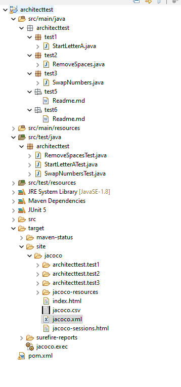
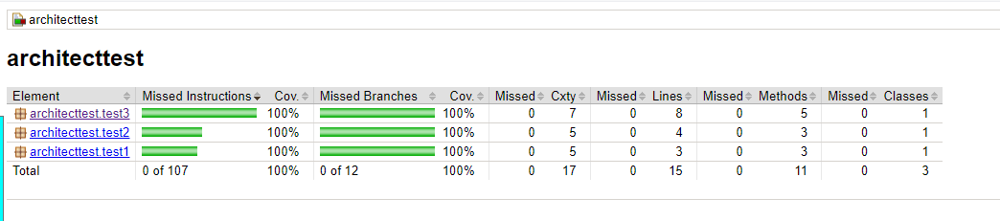

# Architect Test

This project contains almost all the the tests asked for Architect role at Meisters Solutions (5/6 tasks).

## Java Tests

Tasks 1, 2 and 3 are stored inside `architecttest.test1`, `architecttest.test2` and `architecttest.test3` inside `src/main/java` . And inside `/src/main/test` we also have the three JUnit tests made for this three tasks.

The tests also have coverage report by Jacoco stored at `/target/site/jacoco/index.html` to check.

## Architect Tests

Tasks 5 and 6 also have `architecttest.test5` and `architecttest.test6` packages but with Readme markdown file with answers.

# Environment

Maven: v3.5.4

Java: JDK v17.0.9